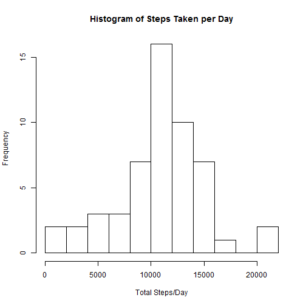

## Loading and preprocessing the data

### Load the data

```r
actdata<-read.csv(unz("activity.zip","activity.csv"))
str(actdata)
```

```
## 'data.frame':	17568 obs. of  3 variables:
##  $ steps   : int  NA NA NA NA NA NA NA NA NA NA ...
##  $ date    : Factor w/ 61 levels "2012-10-01","2012-10-02",..: 1 1 1 1 1 1 1 1 1 1 ...
##  $ interval: int  0 5 10 15 20 25 30 35 40 45 ...
```
### Process/transform the data into suitable format
Convert 'date' column in 'YYYY-MM-DD' format to date  
    
    ```r
    actdata$date<-strptime(actdata$date,"%Y-%m-%d")
    str(actdata)
    ```
    
    ```
    ## 'data.frame':	17568 obs. of  3 variables:
    ##  $ steps   : int  NA NA NA NA NA NA NA NA NA NA ...
    ##  $ date    : POSIXlt, format: "2012-10-01" "2012-10-01" ...
    ##  $ interval: int  0 5 10 15 20 25 30 35 40 45 ...
    ```
Convert 'interval' column in int (0-2355) format to time  
References:  
[Format number as fixed width, with leading zeros](http://stackoverflow.com/questions/8266915/format-number-as-fixed-width-with-leading-zeros), Stack Overflow, Date Accessed: 8/10/2015  

```r
#use formatC to get hours/minutes in two digit format
timestr<-formatC(actdata$interval,width=4,flag="0")
timestr<-paste(substr(timestr,1,2),substr(timestr,3,4),sep=":")
actdata$time<-strptime(timestr,"%H:%M")
str(actdata)
```

```
## 'data.frame':	17568 obs. of  4 variables:
##  $ steps   : int  NA NA NA NA NA NA NA NA NA NA ...
##  $ date    : POSIXlt, format: "2012-10-01" "2012-10-01" ...
##  $ interval: int  0 5 10 15 20 25 30 35 40 45 ...
##  $ time    : POSIXlt, format: "2015-08-11 00:00:00" "2015-08-11 00:05:00" ...
```

## What is mean total number of steps taken per day?  
###Calculate total number of steps for each day  

```r
library(plyr)
totalsteps<-ddply(actdata,.(date),summarize,sum=sum(steps))
```
###Make histogram of total number of steps each day  

```r
hist(totalsteps$sum,breaks=10,main="Histogram of Steps Taken per Day",xlab="Total Steps/Day")
```

 

##Calculate and report the mean and median of the total number of steps taken per day  


```r
dailystepsmean<- format(mean(totalsteps$sum,na.rm=TRUE),nsmall=2)
dailystepsmedian<-format(median(totalsteps$sum,na.rm=TRUE),nsmall=2)
```
###Mean and Median Results for Total Number of Steps Taken per Day  
Mean: 10766.19  
Median: 10765
  
## What is the average daily activity pattern?  

###Calculate average number of steps by interval  


```r
library(plyr)
avgstepint<-ddply(actdata,.(time),summarize,avg=mean(steps,na.rm=TRUE))
```

### Make time series plot for the 5-min interval x-axis  

```r
plot(y=avgstepint$avg,x=avgstepint$time,type="l",main="Average Daily Activity Pattern (NAs removed)",xlab="HH:MM",ylab="Avg Steps")
```

 

### Which 5-min interval on average across all the days in the data set contains the max number of steps  

```r
maxintdetails <- avgstepint[avgstepint$avg==max(avgstepint$avg),]
maxtime<-format(maxintdetails$time,"%H:%M")
maxsteps <- format(maxintdetails$avg,nsmall=2)
```
The time interval with the maximum number of steps is 08:35 with 206.1698 average steps across time period.  

## Imputing missing values

###Calculate and report the total number of missing values in the data set


```r
countnas<-sum(is.na(actdata$steps))
```
Total Number of Steps that are NA is 2304.

### Devise a strategy for filling in all of the missing values for the dataset

####Strategy: Set NAs equal to the average steps for each 5 minute interval 
1. Calculate average steps per interval across all days
2. Merge activity dataset with interval step averages
3. Set NA Steps to 5min interval avg

#####Code Details
1. Calculate Average steps per interval across all days


```r
library(plyr)
avgstepint<-ddply(actdata,.(time),summarize,avg=mean(steps,na.rm=TRUE))
```

2. Merge Create new data set by merging Activity data with Average Step interval data by by time column    
Reference: [Merge on Datatime columns] (http://r.789695.n4.nabble.com/Can-t-merge-on-datetime-td3165187.html)  


```r
#merge Activity data with Average Step info by time column
actdata$time2<-as.POSIXlt(actdata$time,tz="GMT")
avgstepint$time2<-as.POSIXlt(avgstepint$time,tz="GMT")
actdatanew<-merge(actdata,avgstepint,all=TRUE)
```
3. Fill in missing NAs with 5min interval avg

```r
actdatanew$imputedsteps <-actdatanew$steps
actdatanew$imputedsteps[is.na(actdatanew$imputedsteps)] <- actdatanew$avg[is.na(actdatanew$imputedsteps)]
```

### Make a histogram with total number of steps taken each day; calculate and report the mean and median total steps taken per day.
- Calculate total number of steps for each day

```r
library(plyr)
totalstepsimputed<-ddply(actdatanew,.(date),summarize,sum=sum(imputedsteps))
```
- Make histogram of total number of steps each day

```r
hist(totalstepsimputed$sum,breaks=10,main="Histogram of Steps Taken per Day (NAs replaced with Interval Avg)",xlab="Total Steps/Day")
```

 

- Calculate and report the mean and median of the total number of steps taken per day


```r
dailyimputedstepsmean<- format(mean(totalstepsimputed$sum,na.rm=TRUE),nsmall=2)
dailyimputedstepsmedian<-format(median(totalstepsimputed$sum,na.rm=TRUE),nsmall=2)
```
- Central Tendency for Total Number of Steps Taken per Day  
Mean: 10766.19  
Median: 10766.19

From summary, we see quantiles are tighter in imputed data; and NAs are moved into center of distribution.  
Summary Imputed Steps

```r
summary(totalstepsimputed$sum,digits=20)
```

```
##     Min.  1st Qu.   Median     Mean  3rd Qu.     Max. 
##    41.00  9819.00 10766.19 10766.19 12811.00 21194.00
```

Summary Raw Steps

```r
summary(totalsteps$sum,digits=20)
```

```
##     Min.  1st Qu.   Median     Mean  3rd Qu.     Max.     NA's 
##    41.00  8841.00 10765.00 10766.19 13294.00 21194.00        8
```


## Are there differences in activity patterns between weekdays and weekends?

### Create a new factor variable in dataset with two levels, 'weekday' and 'weekend'.

```r
actdatanew$weekday <- weekdays(actdatanew$date)
actdatanew$daytype<- "weekday"
actdatanew$daytype[actdatanew$weekday=="Saturday"| actdatanew$weekday=="Sunday"] <- "weekend"
```
### Make a panel plot, with time series plot (type="l"), of interval on x-axis and average number steps taken across all weekdays or weekend on y-axis.


```r
totaldaytype<-ddply(actdatanew,.(interval,daytype),summarize,avg=mean(imputedsteps))

library(lattice)

xyplot(totaldaytype$avg~totaldaytype$interval | as.factor(totaldaytype$daytype),type="l",xlab="Interval",ylab="Number of Steps")
```

 
